# Mobile Flashcards

This is the last project of the Udacity React Nanodegree.

Its purpose is to apply the learned concepts in the Nanodegree program, including React Native, React Navigation, Expo APIs such as permissions and local notifications, Async Storage, front-end and mobile state management with Redux, ES6+ concepts, etc.

Unlike the material seen in the last mobile course, I have taken the liberty of using Redux [like in the past project](https://github.com/jmorapruna/Udacity.ReactNanodegree.WouldYouRather), now to handle an in-memory copy of the application data using optimistic updates.

As we've seen in the course, this approach provides better performance and less waiting times between interactions.
  
This time I've added [redux-observable](https://redux-observable.js.org/) to explore other Redux middlewares than [Redux Thunk](https://github.com/reduxjs/redux-thunk).

## Functional description

This is a mobile app that people can use to study before exams.

The user can create cards with a question and its answer and store them into a deck.

Each deck and its number of questions is listed in the main screen. Entire decks can also be deleted.

The user can create an empty deck with a name, and from ther she can add new cards at any time.

When a deck is ready, the user can take a quiz to practice for the exam. The app keeps track of the number of correct answers and displays the metric at the end of the quiz.

A daily local notification is generated to improve the app user engagement.

## Used technologies

- [React](https://reactjs.org/) & [React Native](https://reactnative.dev/), including the hooks API not yet covered in this Nanodegree
- [Expo framework](https://docs.expo.io/guides/icons/)
- [React Navigation](https://reactnavigation.org/)
- [Async Storage](https://github.com/react-native-community/async-storage)
- [Redux](https://redux.js.org/) & [React Redux](https://react-redux.js.org/)
- [Redux Observable middleware](https://redux-observable.js.org/) & [RxJS](https://rxjs-dev.firebaseapp.com/)

The project has been created from scratch using [Create React Native App and Expo](https://github.com/expo/create-react-native-app).

## 🚀 How to use

- Install packages with `yarn` or `npm install`.
  - If you have native iOS code run `npx pod-install`
- Run `yarn start` to start the bundler.
- Open the project in a React runtime to try it:
  - iOS: [Client iOS](https://itunes.apple.com/app/apple-store/id982107779)
  - Android: [Client Android](https://play.google.com/store/apps/details?id=host.exp.exponent&referrer=blankexample)
  - Web: Any web browser

  <!-- iOS -->
  
  <!-- Android -->
  
  <!-- Web -->
  

## Screenshots

### Mobile Flashcards app with no decks
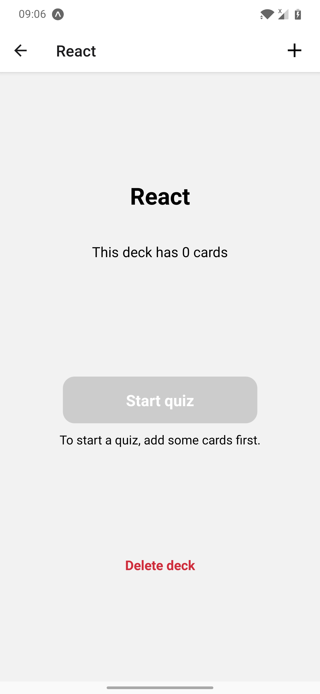

### Taking a quiz (1)
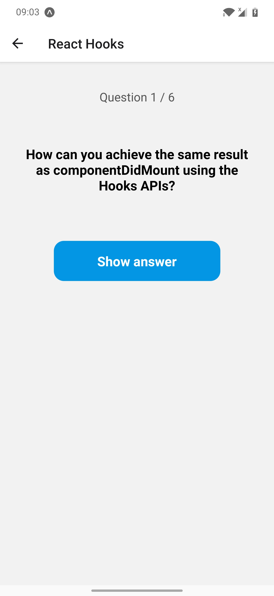

### Taking a quiz (2)
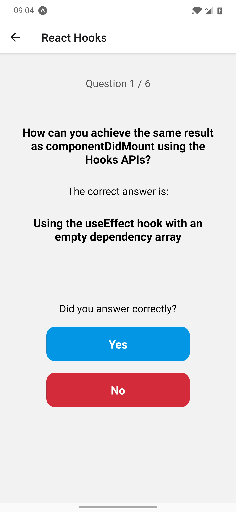

### Taking a quiz (3)
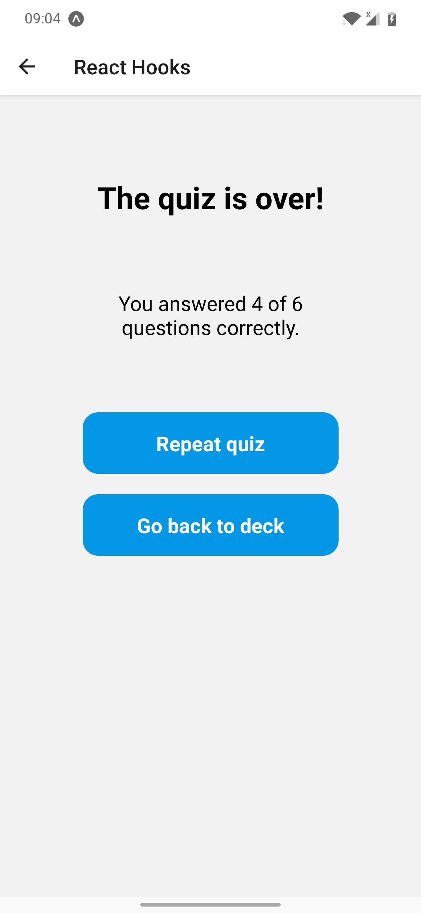

### Adding a card into a deck
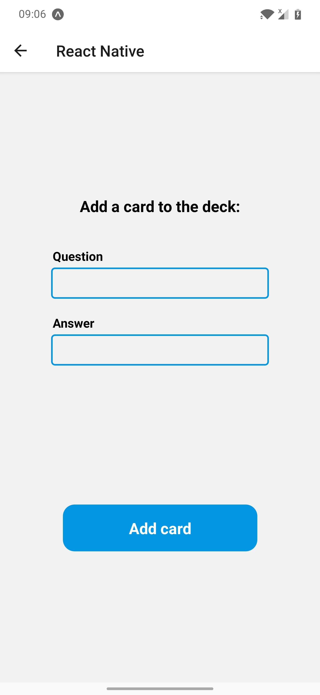

### Adding a card into a deck (with error handling)
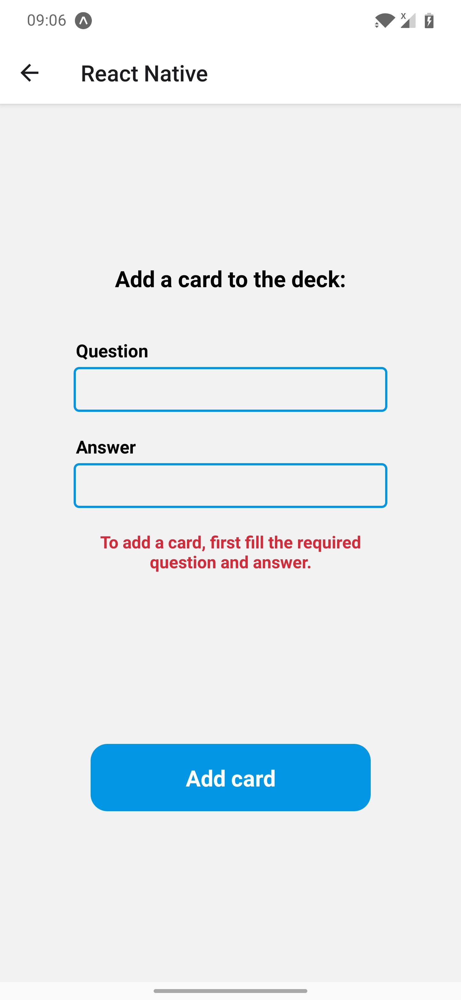

### Adding a deck (with error handling)
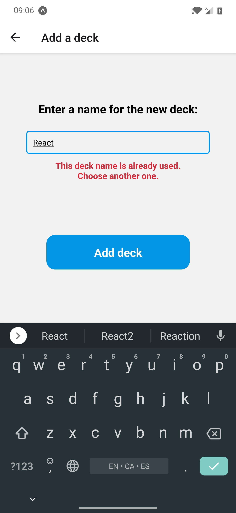

### Inside a deck
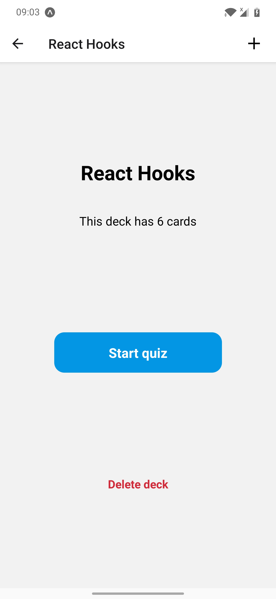

### List of dekcs
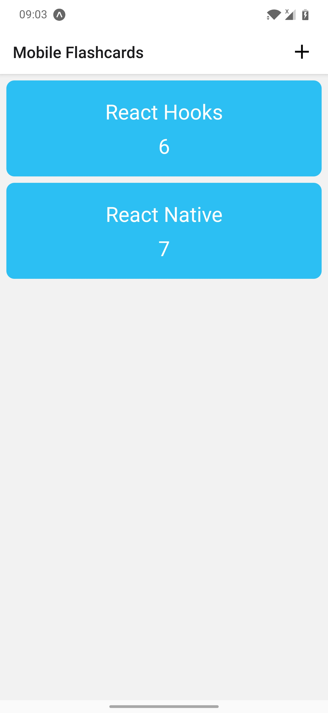

### Deleting a deck
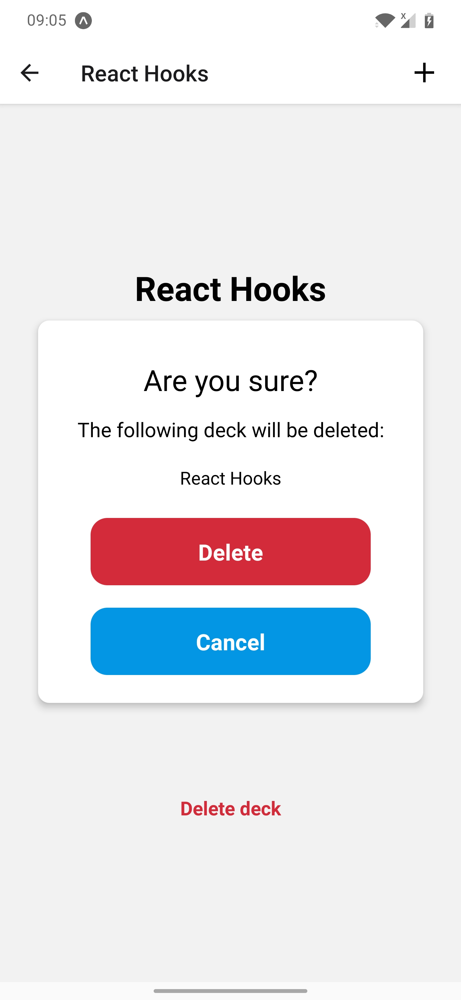

### Mobile Flashcards app with no decks
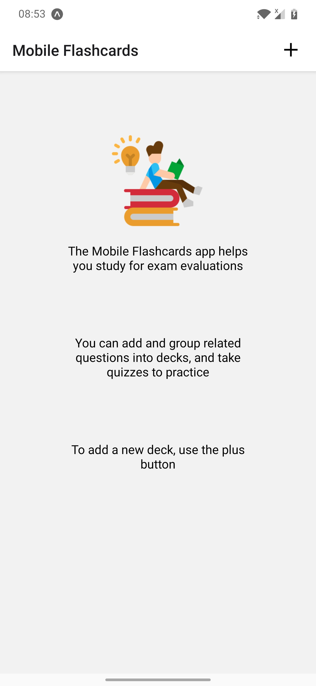

### A generated local notification
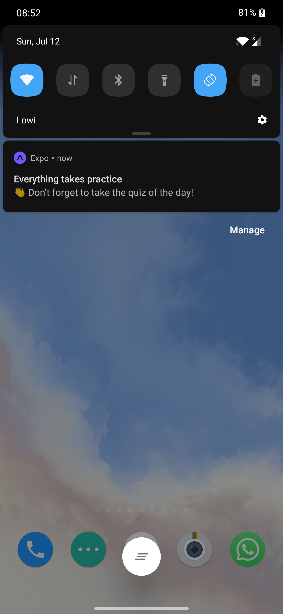

## Adding Native Code

This project can be run from a web browser or the Expo client app. You may find that you want to add more native code later on. You can do this by ejecting the project and rebuilding it yourself.

- Run `yarn eject` to create the native projects.
- You can still run your project in the web browser or Expo client, you just won't be able to access any new native modules you add.

## Publishing

- Deploy the native app to the App store and Play store using this guide: [Deployment](https://docs.expo.io/distribution/app-stores/).
- Deploy the website using this guide: [Web deployment](https://docs.expo.io/distribution/publishing-websites/).

## 📝 Notes

- Learn more about [Universal React](https://docs.expo.io/).
- See what API and components are [available in the React runtimes](https://docs.expo.io/versions/latest/).
- Find out more about developing apps and websites: [Guides](https://docs.expo.io/guides/).
